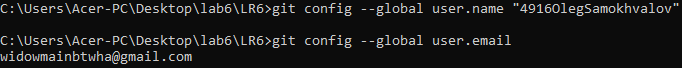
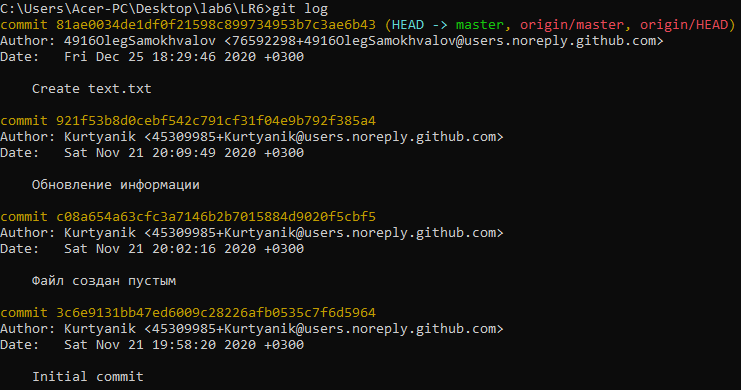
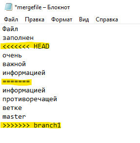

# Отчет о лабораторной работе №6
## Самохвалов Олег гр.4916

### Ход работы:

Была сделана копия репозитория https://github.com/Kurtyanik/LR6/

При помощи команды cd Desktop\lab6 выполняется переход в созданную папку на компьютере. Затем при помощи команды git init инициализируется git в данной папке. После записывается команда git remote add origin для связывания папки с удаленным репзоиторием на GitHub и git clone для клонирования репозитория в данную папку. 

Выполняется вход git с помощью команд git config --global user.name, git config --global user.email

Через сайт GitHub создается текстовый файл text.txt. Выполняется переход в папку, клонированного репозитория cd LR6, затем при помощи команды git pull origin master загружаются изменения из удаленного в локальный репозитории.

Выполняется команда git log, которая показывает список действий в репозитории

При помощи команды git show показывается последние изменение в репозитории.

Затем выполняется переход на ветку branch git checkout -t origin/branch1. После возвращаемся в master при помощи git checkout master.

Выполняется попытка слияния веток branch1 и master командой git merge branch1, однако выдается ошибка.

Исправляется ошибка в mergefile.txt путем удаления выделенных строк.

После редактирования добавляется mergefile.txt используя команду git add, затем выполняется git merge branch1, после слияния удаляется ветка branch1. В конце выполняется git push origin master на удаленный репозиторий.

Создаются 3 файла в удаленном репозитории.

Новые файлы добавляются в локальный репозиторий git pull origin master, просматривается лог действий.

Выполняется откат последнего коммита git reset --hard HEAD~1. Пушим изменения на удаленный репозиторий.

 

Данный текстовый файл удален на удаленном репозитории

Создается новая ветка report, используя команду git checkout -b report. Выводится графический лог git log --graph

После этого скриншоты добавляются в новую ветку git add screenshots. Отправляем коммит с сообщением git commit -m "adding screenshots to report". 

Пушатся файлы скриншотов в обновленны репозиторий.

Повторно просматриваются логи в графическом виде.

Составляется отчет в файле README.md. Данный файл добавляется в новую ветку и пушится в репозиторий.

Финальный результат.

Все скриншоты данной работы лежат в папке screenshots.
